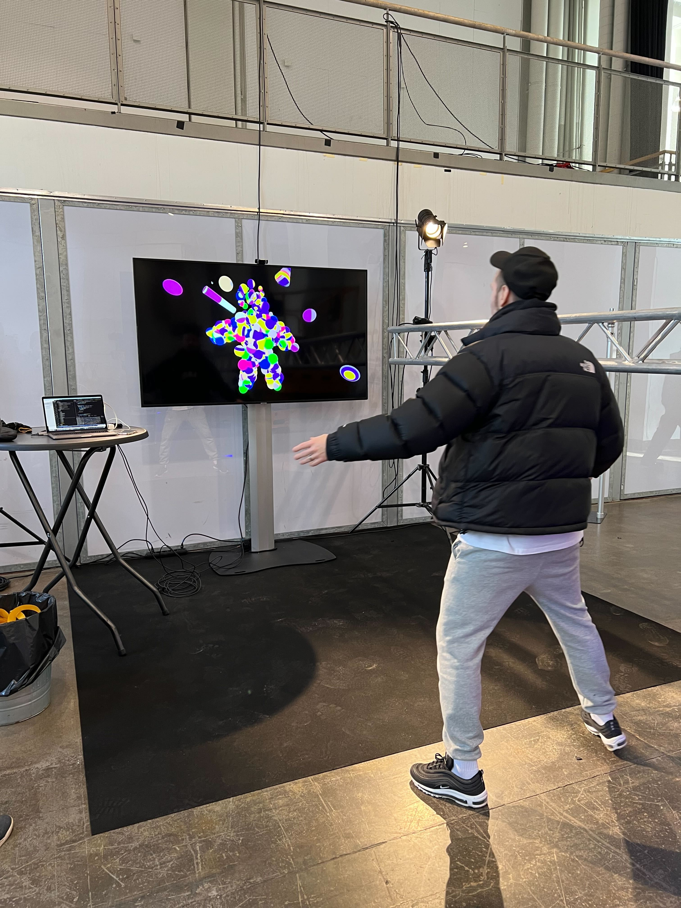

# The Bubble Figure

## What is this?

The Bubble Figure is an interactive art installation that runs in the browser. When a person is recognized in the webcam
it makes them appear as a colorful bubble figure. They can then interact with various shapes that fall from above, for
example, by hitting them. Simple and fun.

## Where can I try it?

[Bubble Figure demo on GitHub pages](https://wunderdogsw.github.io/go-23-app/). Please make sure to step back from the webcam so that your pose is detected.

## Who was it made for?

The installation was made for [Grand One](https://grandone.fi), 2023 edition. These are annual design awards that
take place in Helsinki, Finland. Please see [event photos](https://www.paavopykalainen.com/2023/Grand-One-2023/n-FrhNhf/).

## Why was it built?

Since [Wunderdog](https://www.wunderdog.fi) took part in Grand One 2023, we wanted to experiment, have fun, and show we
could do something beyond our regular day-to-day work.

We decided to build an interactive experience using the event's visual language of basic colorful shapes: spheres, cones
and cylinders. After brainstorming various concepts, and taking the schedule and resources into account, we settled on
The Bubble Figure.

## How does it work?

The Bubble Figure uses [TensorFlow.js](https://github.com/tensorflow/tfjs-models) pose detection to recognize a person
via the webcam. Pose keypoints (e.g. left shoulder, right wrist) are then used to render the figure via [Three.js](https://threejs.org).

The figure is randomized every time a new person is detected. The shapes falling from above are also randomized, while
using certain geometries and textures to fit the Grand One visual language.

To simulate physics, [cannon-es](https://pmndrs.github.io/cannon-es/) is used.

## How can I run it?

The project is managed via [npm](https://www.npmjs.com) and [Vite](https://vitejs.dev). Unfortunately the pose detection
libraries don't work as npm imports, so they are loaded via a CDN.

In the browser, hit `Command + K` on Mac or `Ctrl + K` on Windows to adjust various parameters. Clicking Apply will
save the parameters in the browser's local storage.

Please use Google Chrome, other browsers are not officially supported.

### Setup

`npm install`

### Development

`npm run dev`

### Build

`npm run build`

### Preview

`npm run preview`

## How could I contribute?

At the moment, we are not accepting any further contributions. For any questions or comments, please [contact Wunderdog](https://www.wunderdog.fi/contact).
